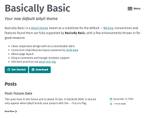

# Dr. Jekyll's Themes - Add Your Theme!

(Yet Another) Static Site Theme Directory - see it live @ [`drjekyllthemes.github.io`](http://drjekyllthemes.github.io)


## How-To Add Your Theme

First fork the [`/themes` repo](https://github.com/drjekyllthemes/themes) on GitHub.

### Step 1: Add a new entry in the `themes.yml`datafile

Add a new entry in the [`themes.yml`](https://github.com/drjekyllthemes/themes/blob/master/themes.yml) datafile 
and fill out all fields. Example:

``` yaml
- title:     Basically Basic
  github:    mmistakes/jekyll-theme-basically-basic
  branch:    master                              ## note: defaults to master; only needed for gh-pages
  demo_url:  https://mmistakes.github.io/jekyll-theme-basically-basic
  author:    Michael Rose
  thumbnail: basicallybasic.png
  license:   MIT
  gem:       jekyll-theme-basically-basic         ## optional
  tags:     [minimal, responsive, blog, resume]   ## optional
```

or (without the github+branch shortcuts)

``` yaml
- title:        Basically Basic
  home_url:     https://github.com/mmistakes/jekyll-theme-basically-basic
  download_url: https://github.com/mmistakes/jekyll-theme-basically-basic/archive/master.zip
  demo_url:     https://mmistakes.github.io/jekyll-theme-basically-basic
  author:       Michael Rose
  thumbnail:    basicallybasic.png
  license:      MIT
  gem:          jekyll-theme-basically-basic         ## optional
  tags:        [minimal, responsive, blog, resume]   ## optional
```

### Step 2 - Add a 250 x 200 thumbnail (screenshot preview pic) in the `thumbnails` folder

Make a 250 x 200 thumbnail and drop it in the thumbnails folder. 
Example: `thumbnails/shiori.png` (250 x 200 px) 



Note: Do NOT forget to list its filename in the `themes.yml` entry.

### Step 3 - Send a pull request

Check that everything is ok, then open up a pull request. 

That's it. Thanks!


---


## Tips & Tricks

Q: How to create a 250 x 200 thumbnail?

A: One way is to create a regular-size screenshoot e.g. 1024 x 768 in step one.
In step two calculate how much to zoom in
(divide the required width, that is, 250 pixel by your current width,
that is, 1024 pixel) e.g.

     250
    ---- * 100 =  24.4 %
    1024

Than readjust the scale to 24.4% and set the width and height to 250 x 200.
That's it.

Another example - let's say the screenshoot size is 500 x 400 using the formula
calculate how much to zoom in e.g.

     250
    ---- * 100 =  50 %
     500


## License

The themes directory is dedicated to the public domain.
Use it as you please with no restrictions whatsoever.

## Questions? Comments?

Post them to the [wwwmake forum](http://groups.google.com/group/wwwmake). Thanks!
